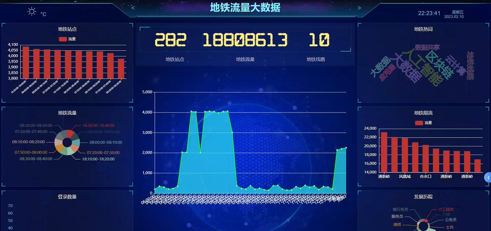
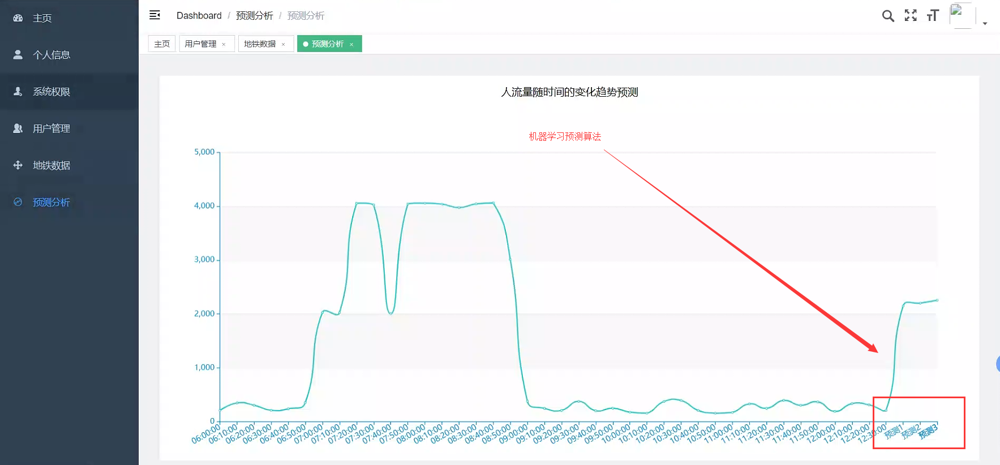
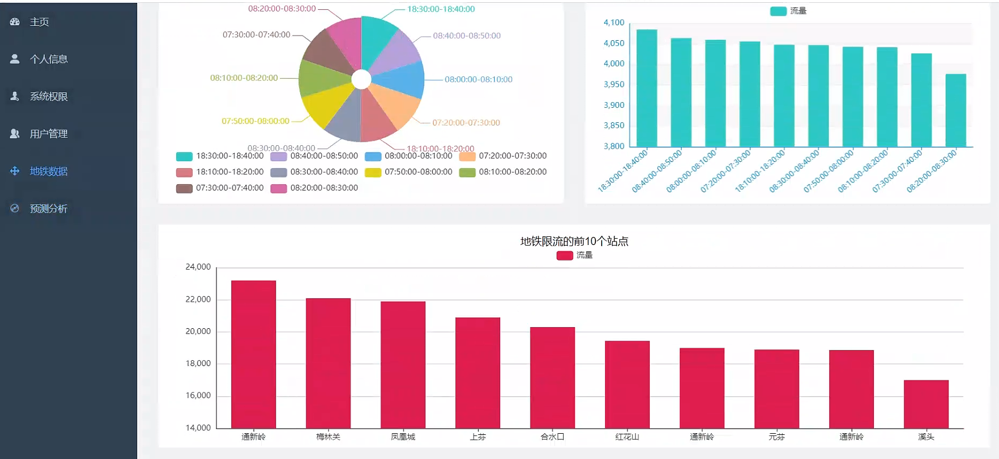

# 计算机毕业设计吊炸天Python+Spark地铁客流数据分析与预测系统 地铁大数据 地铁流量预测 地铁爬虫 地铁客流量分析 大数据毕业设计 大数据毕设 机器学习 深度学习

## 要求
### 源码有偿！一套(论文 PPT 源码+sql脚本)

https://www.bilibili.com/video/BV1r84y1H73J/?spm_id_from=333.999.0.0

https://www.bilibili.com/video/BV1tx4y1V7gY/?spm_id_from=333.999.0.0

代码不免费！我的QQ号是2877135669 或者 1679232425 或者微信：bysj2023nb

### 

### 加好友前帮忙start一下，并备注github有偿获取源码
### 我的QQ号是2877135669 或者 1679232425 或者微信：bysj2023nb
### 加qq好友说明（被部分 网友整得心力交瘁）：
    1.加好友务必按照格式备注
    2.避免浪费各自的时间！
    3.当“客服”不容易，repo 主是体面人，不爆粗，性格好，文明人。

# 开发技术

Spark Hadoop Python爬虫 Vue.js SpringBoot 机器学习/深度学习 人工智能

# 创新点

Spark大屏可视化 爬虫 预测算法

 

 

 

# 运行截图

# 运行视频(B站)

https://www.bilibili.com/video/BV1r84y1H73J/?spm_id_from=333.999.0.0

https://www.bilibili.com/video/BV1tx4y1V7gY/?spm_id_from=333.999.0.0

